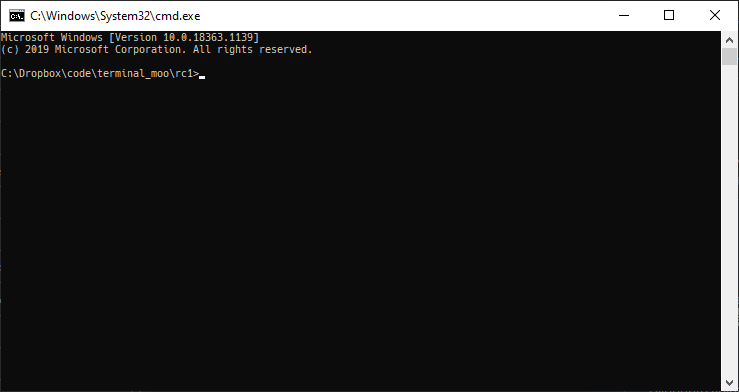
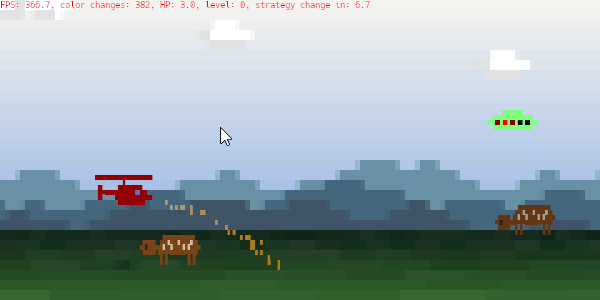
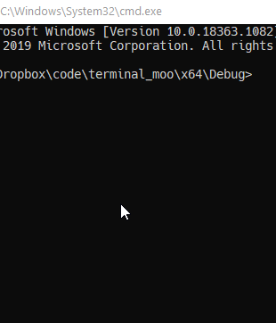
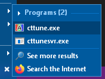

# terminal moo

*terminal moo* is a silly prototype "**text**" game. That means all graphics is generated by using colored letters. Read the [development article](text/text.md) for more info.

A precompiled 64bit windows `.exe` can be found under [Releases](https://github.com/s9w/terminal_moo/releases). You can double-click it, or start it from an existing `cmd` session.

For this to work properly, you'll need to use a font that contains block elements. Here's an overview of popular monospace fonts and how well they work:

- Great: [Hack](https://github.com/source-foundry/Hack), [3270font](https://github.com/rbanffy/3270font), [PragmataPro](https://github.com/fabrizioschiavi/pragmatapro), [Source Code Pro](https://github.com/adobe-fonts/source-code-pro), [Fira Mono](https://mozilla.github.io/Fira/)
- Minor distortions: mononoki, iosevka, 
- Heavy distortions: Cascadia Code, inconsolata, Input mono , Menlo
- Don't contain block elements: Consolas, Lucida console

You can change your `cmd` font by right-clicking on the title bar and clicking properties.

For an even better visual experience, disable ClearType by running cttune. That's the windows subpixel font rendering engine. It was made for text and the abusive use of text in this program breaks it, resulting in some discolored vertical and horizontal lines. It's not horrible though, so not required.

Player follows mouse, shoot by clicking. Keyboard works also, mouse can be disabled in the config.

Feel free to look in the `config.toml` or change the images for hacking.

## Compiling

This is currently windows only, VS solution is included. You'll need a compiler that supports C++20 (for default comparison operators, `<numbers>`, std::midpoint, concepts). Not sure about the exact minimal Visual Studio version - might be 16.4.

## Windows Terminal
Mouse input doesn't work in [Windows Terminal](https://github.com/microsoft/terminal) (not to be confused with `cmd.exe`), so I suggest you disable it in the config and use the keyboard. Also it reports a high fps, but feels really sluggy. I didn't investigate that further.
