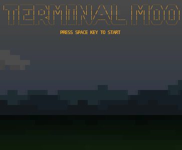
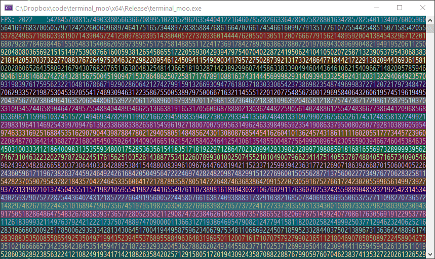
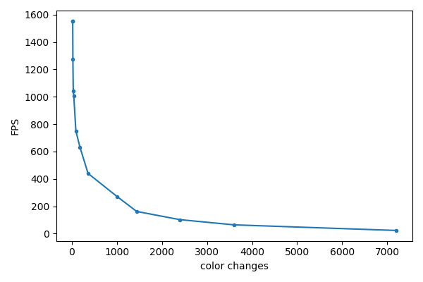
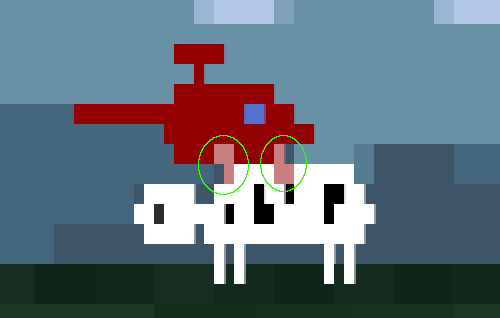
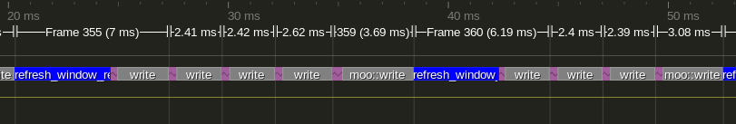
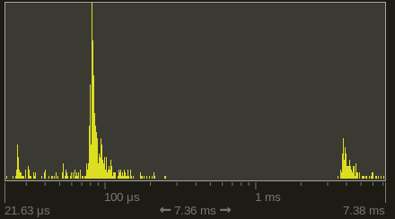

# Writing terminal moo: On C++, its ecosystem, performance optimization and more

## Intro
Recently I learned about [Block Elements](https://en.wikipedia.org/wiki/Block_Elements) - a set of unicode characters that fill the quadrants (i.e. bottom right, upper left etc.) of a 'letter'... all 16 permutations of those.


That's clearly a tool designed to abuse letters as 2x2 pixel fields! From here on out I will refer to those quadrants as pixels. In Windows, a default `cmd.exe` console window contains 120x30 characters which result in 240x60 pixels. That's quite workable to have some fun. After a bit more research I learned that the windows console [added full 24bit color support](https://devblogs.microsoft.com/commandline/24-bit-color-in-the-windows-console/) a while back. And those colors can be set for foreground and background separately. So I set out to write a little game.

I'll use this pet project to report on my experience with things I encountered. Mostly C++, its friends and performance optimization.



## Performance part 1: Colors
Before going head first I wanted to make sure the principle is sound. It's common knowledge that console output can be surprisingly slow. I was worried that this might make an actual real-time game impossible. As a quick performance test I filled the entire screen with different characters and "rendered" that repeatedly. That ran very fast, no concerns yet. Next up: colors. I changed foreground and background colors in increasing numbers.



I learned: Colorful text is not slow in itself but lots of color changes are:



But the good news is: Even with 3600 color changes (that's foreground and background color change for every second character), this works at ~60 FPS. So the colors shouldn't be a show-stopper.

## Color constraints
Every character on screen has a foreground (FG) and a background (BG) color. The character itself gets the FG color, the rest is BG. When restricting to box elements that means in each character you can fully control the geometry of the 2x2 pixels but can only use two colors.

I solved the color limitation with a model that I think worked great. I treated BG and FG graphics differently. In the background I limited myself to full characters of the same color, thereby giving up the resolution advantage obtained by the block elements.

The foreground objects I treated with full resolution, but very limited color. The nice consequence of that approach is that there is a relatively simple algorithm to select final FG and BG colors for each character:

Pick one color from the background and the other from the foreground. Ideally that works out since the color choice is so limited there. In cases where no background can be seen, I can use two colors from FG objects.

If there are more than two colors in a characters, I try to mitigate the disaster by blending colors together. That happens whenever foreground objects get very close to each other. That effect can be subtle in the often occurring cases of faint smoke puffs discoloring each other or other foreground objects:


It can look harsher with two large and slow objects. Flying directly over or next to cows or ufos can provoke these glitches:



There's no perfect way around that limitation in these cases. Restricting the movement to prevent this would feel wrong.

Since the background is pretty low resolution, any movement would look very choppy. To mitigate that I linearly interpolated the background objects horizontally. That makes it look blurry on the edges but it's a win overall because of the much increased smoothness:


All in all, I feel like that worked out quite well. In theory this could be improved further. For example the majority of the screen usually consists of just background. That could be taken advantage of by have a higher-resolution model of the background that gets used if unoccluded by any foreground objects, and fallback to the half-res model otherwise.

I had some trouble getting the ufo beam to look nice. Using foreground graphics was a disaster because of the color limitations. Using background graphics meant a much simpler effect, but the beam of light looks quite fitting. But then you have the problem with the Ufo being and moving at twice the resolution of the beam effect. I designed around the technical limitations: Ufo and cow stays still when beaming and also I make sure it "parks" at a character-aligned position. And instead of the cow moving upwards, I just fade it out which worked well.


## Platform, compiler & libraries
Since I don't have access to a non-windows PC and use some OS-specific functions (positioning of text cursor, disabling text selection, getting mouse position and clicks, information about the window), I limited myself to that. Latest Visual Studio (16.8.0 Preview 4.0) and C++20. It was odd to have neither ImGui for quick changes nor the console for debug outputs. But the concept was simple enough that most things worked well without.

I used a couple of my all-time favorite C++ libraries. For Image IO, [`stb_image.h`](https://github.com/nothings/stb) never failed me.

For unit testing, I'm a cheerleader for [doctest](https://github.com/onqtam/doctest/). It does the usual things all unit testing libs do. But its killer feature is that the tests don't live in another project you never touch but rather right next to your code. And they run every time you start the program (or whenever you tell it to - I let mine run in the debug builds). That way they're not just tests but are really part of the documentation. Not exactly sure what `get_triangle()` did? Looking at those tests right underneath couldn't make things clearer.

```c++
constexpr auto moo::get_triangle(const double x) -> double {
   if (less(x, 0.5))
      return 2.0 * x;
   else
      return 2.0 - 2.0 * x;
}
TEST_CASE("get_triangle()") {
   CHECK_EQ(moo::get_triangle(0.0), doctest::Approx(0.0));
   CHECK_EQ(moo::get_triangle(0.5), doctest::Approx(1.0));
   CHECK_EQ(moo::get_triangle(1.0), doctest::Approx(0.0));
}
```

It's underrated and suffers from an unfortunate name. doctest is originally a unit testing thing for Python. There the name made more sense as it literally parses function docstrings.

[Tracy](https://github.com/wolfpld/tracy) is just wonderful. Its usefulness, polish and development speed blows commercial alternatives out of the water. There's more on Tracy and on the also used [EnTT](https://github.com/skypjack/entt) below.

I also used [toml++](https://marzer.github.io/tomlplusplus/). I like the more lightweight feel of TOML compared to json. Library use was straightforward, I like great readme/documentation. I also share the authors views on [error handling](https://www.reddit.com/r/cpp/comments/iwych1/code_review_of_toml/g649q6l/) :).

For occasional string formatting, I used [fmt](https://github.com/fmtlib/fmt).

I integrated all the libraries using [Vcpkg](https://github.com/microsoft/vcpkg). And no, I did not use Cmake.

## C++ types
As the program grew, an increasing number of variables with different meanings, but technically equal types were born. For better or worse, it's very easy to mix and match them. What's convenient first quickly descends into hard to find bugs. At that point one of C++ biggest shortcomings come to light: The lack of *easy* strong types.

Sure you can write strong and expressive types, but you end up having to write a lot of boilerplate if you want to use common operators on them. C++20 improved that a bit by providing default comparison operators. But if you want to use arithmetic with your type that wraps Seconds, a lot of code is needed. There have been standard proposals for this but they didn't go anywhere as far as I'm aware.

## Error handling
With a program as simple and deterministic as this, I like the approach of blurting out an error message, and `std::terminate()`ing the program. Might not be a recommendation for everyone though.


## Performance part 2: Strings
Color changes happens by printing a special kind of string sequence. 

```c++
"\x1b[38;2;<R>;<G>;<B>m" // foreground color
"\x1b[48;2;<R>;<G>;<B>m" // background color
```
What *terminal moo* does is for each character on the screen to decide on a block element to use, and inserting these color strings whenever the colors don't match the previous block.

Besides the cost to render those color changes discusses above, those strings actually have to be constructed first. My first go-to was the fantastic [fmt](https://github.com/fmtlib/fmt) library:
```c++
fmt::format(L"\x1b[48;2;{};{};{}m", rgb.r, rgb.g, rgb.b);
```
Rendering a string with 1000 color changes takes ~3.2ms. Constructing and appending them with this method takes 154.0µs, so about 5% of that time. `fmt` does have the option of compiling expressions beforehand for faster parsing, but apparently that doesn't work for the required `wstring`s. It was actually faster to build the string myself and not use `fmt`:

```c++
std::wstring str;
str.reserve(20);
str += L"\x1b[48;2;";
str += std::to_wstring(rgb.r);
str += L";";
str += std::to_wstring(rgb.g);
str += L";";
str += std::to_wstring(rgb.b);
str += L"m";
return str;
```
I was a bit surprised about that.


That ran in 127.3µs (40% faster). Even faster is skipping the passing around of the constructed string and appending them into a `std::wstring&` parameter directly. That takes it down to 59.4µs (another 53% faster). At that point the string generation takes just 1.9% of the time to render the resulting string.

Even faster is generating all needed colors at program start and using color indices. In the same scenario that only takes 10.3µs (another 83% faster). But relative to the time of the rendering, the savings are tiny and you lose a lot of flexibility since you have to decide on all colors at the start. That makes things like emulated transparency much harder. Also you have write some wrapping code for the indices to make them convenient to use.

This was where I made my first big mistake: I did actually use color indices first. I was worried too much about performance and didn't plan for the advanced features this made impossible. I ended up changing this later, which took time.

## Performance part 3: Tracy
If you want to look into performance of C++ programs, I can't recommend Tracy enough. Actually seeing graphical representation of when the different parts of your program run is invaluable and often more insightful than looking at sampling counts. This is ~9 frames of *terminal moo* in Tracy:



It's immediately obvious that some frames take way longer than others. In particular `refresh_window_rect()` is usually fast but sometimes super slow. A quick look at Tracys zone histogram confirms this (logarithmic x-scale!):



About every 16 ms or so it's really slow. That's a time every real-time dev knows: 60 times per second. I guess Windows really only runs that function properly in sync with the monitor refresh rate or something. It takes up ~23% of the runtime. It could probably reasonably be tamed by reducing the frequency this is refreshed. This is 'only' used to properly locate the mouse position relative to the game screen, so a couple of times per second would be reasonable enough.

I also noticed a suspicious gap between two Zones of directly adjacent function calls. Parameter passing happens before a function body is entered. I accidentally passed a string by copy and not by reference. It happened to be the string that contains all color codes and characters. That typically weighs in about 10 KB. Not a disaster performance-wise, but nice to catch. No static analysis tool warned me about this. This could probably be caught in a sampling profiler as a suspicious amount of time spend in some string constructors. But seeing a direct gap between two zones make this much easier.

Tracy also alerted me to a function that was much slower than it had any right to be since it was just doing some math. Further inspection yielded that it was using `std::round()`, which was unnecessary at that point. Eliminating that meant I could rewrite the function as `constexpr` and reduced the runtime of the function by 82%.

At the time of writing,
- 55% of the time is spend rendering the string
- 23% asking the Windows API about the current window rect
- 5% is telling Windows API to set the cursor to the top left position
- Then comes the actual work: 2.0% is background graphics
- 1.8% is combining the foreground and background buffers to decide on a block element, FG and BG colors, generate those colors and append everything to the rendering string

Any further optimizations would be best spend in minimizing API calls and reducing the number of colors.

## C++ constexpr weirdness
C++ `constexpr` functions have seen a lot of love recently and are potentially super powerful. However there is something in the standard I tripped over twice during this. So the basic thing about `constexpr` functions is that they can be used at runtime or at compile time. I made the naive assumption that if you declare a function `constexpr` incorrectly by using a non-`constexpr` function call inside them, that the compiler would throw an error at me since it can **never** be compile-time evaluated. That works in some cases, but technically the standard says that while it is technically an error, `no diagnostic required` - meaning the compiler doesn't have to give an error.

That's pretty crazy or at least very different from all other parts of the language I know. That means if things get non-trivial, for example by simply [using templates](https://stackoverflow.com/questions/64220243) or [conditions](https://stackoverflow.com/questions/64371808), the compiler will compile a `constexpr` function although it can never be used at compile time. Trying to force a compile-time evaluation yields a compile error of course.

Maybe I'll find out why the standard was written like that. But for the moment, there is a nice way of dealing with it: `clang-tidy` reports uses like that as actual errors. And even has a warning for `constexpr` functions that never get used in a compile-time context.

## C++20
I used [`std::midpoint`](https://en.cppreference.com/w/cpp/numeric/midpoint) for the first time. Riddle: Say we have a simple color class:
```c++
struct RGB {
   unsigned char r, g, b;
};
```
If you use `std::midpoint()` to compute the mix of two colors, i.e. use it on their r/g/b component-wise. What would you think is the result of mixing `{255, 0, 0}`(red) and `{0, 255, 0}`(green)? It's `{128, 127, 0}`! Life never gets boring in C++.

I used modules a bit, but really just to try them. The worked.. not much to say yet.

The default comparison operators (or spaceship operator as the cool kids say) work well. Thank you committee and compiler devs.

## EnTT
When things got more complex with the introduction of ufo behavior, collision detection and different kind of projectiles, I introduced [EnTT](https://github.com/skypjack/entt). I had good experience with it in the past and it was a good fit. Using [ECS](https://en.wikipedia.org/wiki/Entity_component_system) does feel like cheating. I think there's really two parts to this: The good part is that the idea of decomposing "things" (classes/entities) into their components is a powerful principle that feels right and works excellent in practice. The other part I'm more worried about is that you essentially end up having a god object that manages all your things. It feels less like C++ since you lose the tight control over inputs and outputs of your functions.

Another drawback is that it makes debugging more difficult. Since there are no longer objects or your trusted STL containers, you can't easily inspect them. And you can't use your favorite `<algorithm>` functions. But all that might improve with growing familiarity.

For games, this is a big time-saver. The library itself is rock-solid, the dev is a saint and I plan on using it more in other projects. I have a slight sense that ECSs are under-appreciated. Maybe the somewhat mysterious aura they convey doesn't help.

## Global variables
I technically used global variables for these things (fight me I guess?):

In a project like this, the number of rows and columns is essential for a most basic functions. Passing them through as parameters in almost every function didn't feel much better than just declaring them as accessible variables somewhere safe, so that's what I ended up doing.

Also I used one globally accessible random number generator since that was required in many different places. The uses changed a lot during development and changing function parameters all the time was considered a worse alternative.

Last thing is the config. Needed in many random places, so there's a global access function that returns a static object.

## Static analysis
Visual Studios highest practical warning level is `/W4`. With `/Wall` you get endless errors from 3rd party libraries, the standard library itself and warnings that are trivial if you don't do infosec. But why does the relatively high `/W4` not warn me about passing a `bool` into an `int` parameter and the other way round? That warning actually existed in earlier versions [but was apparently removed](https://docs.microsoft.com/en-us/cpp/error-messages/compiler-warnings/compiler-warning-level-3-c4800?view=vs-2017).

That's an easy mistake to make when you change your function signatures around. And it's always unintended.

```c++
int int_function(int a) {
   return 1;
}

int bool_function(bool a) {
   return 1;
}

bool b = true;
int i = 5;
int_function(b);  // no warning!
bool_function(i); // no warning!
```

Clang-Tidy also doesn't catch those. It did however find some other mistakes:
   - I technically had a function defined too late in a header file, but Visual studio compiled it anyways.
   - A `Value stored to 'second_size' during its initialization is never read` error lead me to a variable I mistakenly didn't use. In this case it was not critical but still nice to find.
   - Some old dead code that I could eliminate also thanks to unused value warnings.
   - A bunch of warnings about signed/unsigned comparisons. I fixed those I believe to be reasonable and ignored the rest.
   - The `constexpr` problems above

Since Clang-Tidy is integrated into Visual Studio I find it relatively straightforward to use. It just sometimes "fails" its run but still outputs all the warnings. Good enough to let it run occasionally. There's also [Clang Power Tools](https://clangpowertools.com/) which are free for personal use. That ran faster and more reliable than the builtin VS clang. 

[Cppcheck](https://github.com/danmar/cppcheck) didn't like the C++20 spaceship operator and failed entirely.

## vcperf
I've had great experience with [vcperf](https://github.com/microsoft/vcperf) since they added the timetrace export. Using it for compile time optimization on a project like this is overkill since a complete rebuild is under 10 seconds, and most incremental builds are under 1s.

I still had a look and it confirmed the [previous wisdom](https://github.com/s9w/cpp-lit): `<array>`, `<filesystem>` and `windows.h` are expensive, as are most external libraries. The compile times could probably be reduced to a fraction by using precompiled headers, or the module versions of the standard library. In another project I used it to half the compile time, and that was much larger (in the multi-minute region).

So I can recommend this in general. Have a look at [compile times of standard headers](https://github.com/s9w/cpp-lit) and go ham.

## Mistakes
A lot of the code is based on iterating over the rows and columns and doing some math with that. I ended up abstracting that into iterators relatively late, which was a mistake. Also the abstractions I chose were at least in one case lazy and not well thought-out. But at that point I kinda ran out of steam to push this to technical perfection since it wasn't a big deal to fix by other means.

Another mistake was moving from my own types to EnTT a bit too late. There's still at least two classes that don't deserve to exist and will be dissolved in the near future.


## Outlook and assorted insights
In practice I find the rules for where C++ function definitions have to be written cumbersome. "Usually" it's the classic header/source split. But then you use templates and you have to define them in the header file. But you *really* don't if you declare them properly in the `.cpp`. But then you declare a function `constexpr` and then you **really** have to put them in the header file. I understand the technical reasons, but it's still annoying when you get your initial guess about the type of the function wrong. This could in theory be mitigated by IDEs that make moving code easy, but in practice even with Visual Assist this is a game of luck.

Talking about IDEs, there is Visual Assist as an upgrade for Visual Studios C++ experience. I find it hit or miss. [Its rename](https://docs.wholetomato.com/default.asp?W154) is better than vanilla VS, but it still misses trailing return types. Same for [its F12 replacement](https://docs.wholetomato.com/default.asp?W191): Better but not perfect. I really love [the alt+m function list](https://docs.wholetomato.com/default.asp?W192) and [a-s-f find reference feature](https://docs.wholetomato.com/default.asp?W189). And the automatic include can be helpful. But VA did get worse recently and VS is really catching up. Good work on that by the way.

Overall I must say I find the IDE experience improving, but still lacking. Ten years ago or so in my previous life as a Python dev with PyCharm it was easy to extract an expression into a variable and the other way round. Why is this not a thing in C++? People are talking about AI and how it's going to replace so many jobs. This is about as realistic as 80s SciFi painting a picture of flying cars being around the corner when after decades my IDE can't reliably rename a function.

Despite its numerous intricacies, I actually like modern C++ overall. I don't share the view that integrating libraries into your project is the language biggest problem. Even when not using Vcpkg, doing things manually is usually straightforward. At least as long as you're not using CMake or other meta-buildsystems - but that's really another issue. The language has many quirks that can't be fixed for technical reasons people like me don't care about at all. I'd like to say that would embrace version of C++ that breaks things left and right if it means having less insanity - but I don't know enough about the details of the process to have a strong opinion on that.

There are some things that can be pushed further in *terminal moo*. First of all the gameplay aspects are barely developed beyond a prototype stage. In technical aspects I should add shadows for cows. And multiple ufos should be fun and relatively easy thanks to EnTT. I'll probably take a break and then revisit things.
